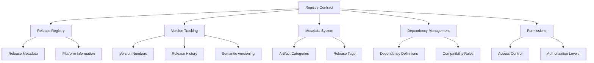
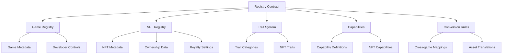

# Release Tree Library

## Overview

Release Tree Library provides developers with a comprehensive solution for managing software releases, tracking versions, and maintaining detailed metadata across different platforms. The library offers:

- Centralized registry for digital asset releases
- Version tracking and dependency management
- Standardized metadata and tagging system
- Release capability definitions
- Flexible permissions and access control
- Cross-platform release information

## Architecture

Release Tree is built around a central registry contract that manages release metadata, versions, and cross-platform compatibility.



The system uses several key data structures:
- Release Registry: Stores release metadata and platform information
- Version Tracking: Manages semantic versioning and release history
- Metadata System: Defines and tracks release attributes
- Dependency Management: Handles cross-platform compatibility
- Permissions: Controls access and authorization levels

## Contract Documentation

### release-registry.clar

This is the core contract managing the Release Tree Library's functionality.

#### Key Functions

**Release Management:**
- `register-release`: Create a new release in the registry
- `update-release`: Modify existing release details
- `get-release`: Retrieve release information
- `list-releases-by-developer`: List releases by developer

**Version Tracking:**
- `create-version`: Register a new version for a release
- `update-version`: Modify version metadata
- `get-version`: Retrieve version details
- `check-version-compatibility`: Verify cross-platform compatibility

**Metadata System:**
- `register-release-category`: Define new release categories
- `set-release-tag`: Assign tags to releases
- `get-release-tag`: Retrieve release tag information

**Dependency Management:**
- `register-dependency`: Define release dependencies
- `set-release-compatibility`: Configure cross-platform rules
- `get-release-dependencies`: Check release dependencies

## Getting Started

### Prerequisites
- Clarinet
- Stacks wallet for deployment
- Understanding of semantic versioning

### Installation

1. Clone the repository
2. Install dependencies
```bash
clarinet install
```
3. Test the contracts
```bash
clarinet test
```

### Basic Usage

1. Register a release:
```clarity
(contract-call? .release-registry register-release 
    "release-123" 
    "My Software" 
    (some "https://mysoftware.com") 
    "Software description")
```

2. Create a version:
```clarity
(contract-call? .release-registry create-version
    "release-123"
    "1.0.0"
    "https://artifact.url"
    u500) ;; 5% maintenance fee
```

3. Set release compatibility:
```clarity
(contract-call? .release-registry set-release-compatibility
    "release-123"
    "platform-abc"
    "{\"requirements\":\"min version 1.2.3\"}")
```

## Development

### Testing

Run the test suite:
```bash
clarinet test
```

### Local Development

1. Start Clarinet console:
```bash
clarinet console
```

2. Deploy contracts:
```bash
clarinet deploy
```

## Security Considerations

### Permissions
- Contract owner has administrative privileges
- Developers can manage their own releases
- Version creators can update metadata
- Compatibility rules require proper authorization

### Limitations
- Maximum maintenance fee is 10%
- Release IDs limited to 50 characters
- Maximum 50 versions per release
- Metadata URL length limited to 255 characters

### Best Practices
- Verify authorization before operations
- Validate all input parameters
- Use semantic versioning
- Follow standardized JSON formats
- Regular security audits recommended

A Clarity smart contract library for managing release and versioning of digital assets with robust tracking, metadata management, and cross-platform compatibility.

## Overview

GameWeave enables game developers to create interoperable NFT assets that work across multiple games and virtual environments. The platform provides:

- Centralized registry for cross-game NFT assets
- Standardized metadata and trait system
- Capability definitions for NFT functionality
- Asset conversion rules between games
- Royalty management for creators
- Flexible permissions system

## Architecture

GameWeave is built around a central registry contract that manages the relationships between games, NFTs, and their cross-game representations.



The system uses several key data structures:
- Games Registry: Stores game metadata and developer information
- NFT Registry: Maintains core NFT data and ownership
- Trait System: Defines and tracks NFT attributes
- Capabilities: Manages what NFTs can do in different environments
- Conversion Rules: Defines how assets translate between games

## Contract Documentation

### gameweave-registry.clar

This is the core contract managing the GameWeave platform's functionality.

#### Key Functions

**Game Management:**
- `register-game`: Register a new game in the ecosystem
- `update-game`: Modify existing game details
- `get-game`: Retrieve game information
- `get-games-by-developer`: List all games by a developer

**NFT Management:**
- `register-nft`: Create a new NFT in the registry
- `update-nft`: Update NFT metadata
- `get-nft`: Retrieve NFT details
- `is-nft-compatible-with-game`: Check game compatibility

**Trait System:**
- `register-trait-category`: Define new trait types
- `set-nft-trait`: Assign traits to NFTs
- `get-nft-trait`: Retrieve NFT trait values

**Capabilities:**
- `register-capability`: Define new NFT capabilities
- `set-nft-capability`: Configure NFT capabilities
- `get-nft-capability`: Check NFT capabilities

**Conversion Rules:**
- `create-conversion-rule`: Define how NFTs translate between games
- `update-conversion-rule`: Modify conversion rules
- `delete-conversion-rule`: Remove conversion rules

## Getting Started

### Prerequisites
- Clarinet
- Stacks wallet for deployment
- Understanding of NFT standards

### Installation

1. Clone the repository
2. Install dependencies
```bash
clarinet install
```
3. Test the contracts
```bash
clarinet test
```

### Basic Usage

1. Register a game:
```clarity
(contract-call? .gameweave-registry register-game 
    "game-123" 
    "My Game" 
    (some "https://mygame.com") 
    "Game description")
```

2. Register an NFT:
```clarity
(contract-call? .gameweave-registry register-nft
    "nft-123"
    "My NFT"
    "game-123"
    "https://metadata.url"
    u250) ;; 2.5% royalty
```

3. Create a conversion rule:
```clarity
(contract-call? .gameweave-registry create-conversion-rule
    "nft-123"
    "target-game-id"
    "Display Name"
    "https://asset.url"
    "{\"properties\":\"value\"}")
```

## Function Reference

### Game Management

```clarity
(register-game (game-id (string-ascii 50)) 
               (name (string-ascii 100)) 
               (website-url (optional (string-ascii 255))) 
               (description (string-utf8 500)))

(update-game (game-id (string-ascii 50)) 
             (name (string-ascii 100)) 
             (website-url (optional (string-ascii 255))) 
             (description (string-utf8 500))
             (active bool))
```

### NFT Management

```clarity
(register-nft (nft-id (string-ascii 50))
              (name (string-ascii 100))
              (origin-game-id (string-ascii 50))
              (metadata-url (string-ascii 255))
              (royalty-percentage uint))

(update-nft (nft-id (string-ascii 50))
            (name (string-ascii 100))
            (metadata-url (string-ascii 255))
            (royalty-percentage uint)
            (active bool))
```

## Development

### Testing

Run the test suite:
```bash
clarinet test
```

### Local Development

1. Start Clarinet console:
```bash
clarinet console
```

2. Deploy contracts:
```bash
clarinet deploy
```

## Security Considerations

### Permissions
- Contract owner has administrative privileges
- Game developers can manage their own games
- NFT creators can manage their assets
- Conversion rules require proper authorization

### Limitations
- Maximum royalty percentage is 30%
- Game IDs limited to 50 characters
- Maximum 20 games per developer
- Metadata URL length limited to 255 characters

### Best Practices
- Verify authorization before operations
- Validate all input parameters
- Keep metadata URLs permanent
- Follow standardized JSON formats for properties
- Regular security audits recommended
